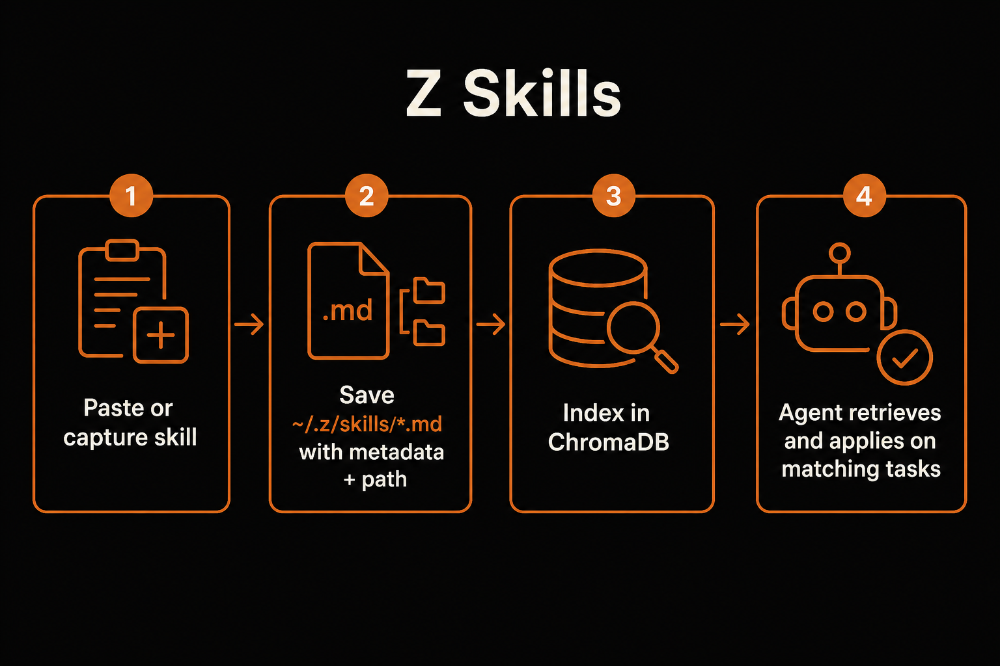

# Z Skills

**Teach Z once. It remembers how your repo works.**

Z Skills turns the way you build — Stripe webhooks, migrations, auth patterns, team conventions — into reusable playbooks. Paste one, generate one, or let Z capture one after a good turn. Next time the task shows up, Z finds the right skill and applies it automatically.

---

## The problem it solves

Coding agents forget your project’s rules the moment the chat ends.

You re-explain the same Stripe signature check. You restate the same Alembic expand/contract rule. You paste the same “how we do auth here” notes into every session. That friction is pure waste — and it gets worse as the codebase grows.

**Z Skills fixes that.** You save the playbook once. Z indexes it, retrieves it when a task matches, and follows it without you attaching files or re-prompting.

| Pain | Without skills | With Z Skills |
|------|----------------|---------------|
| Repeat yourself every session | Re-paste conventions into the chat | Skill auto-applies on match |
| “Where did we document that?” | Hunt old chats / Notion / READMEs | `~/.z/skills/` + ChromaDB retrieval |
| Agent invents the wrong pattern | Guessy defaults | Your playbook, loaded by path |
| Capture good work | Lost after the turn | Opt-in “save as skill?” after a task |

---

## How it works



1. **Create** — paste a playbook, generate from a prompt, or capture after a completed task  
2. **Store** — markdown file in `~/.z/skills/*.md` with metadata (including `path`)  
3. **Index** — metadata + embedding in local **ChromaDB** (`~/.z/chroma/skills`)  
4. **Apply** — before a task, Z queries the index, opens the file at `path`, and follows the skill  

Z owns metadata inference (`title`, `description`, `tags`, `triggers`, `project_types`, `path`). You write the body; you don’t fill out a form.

---

## Quick start

```bash
# Paste / import (simplest)
z skill add
# or inside a session:
# /skills add

# Generate from a prompt (uses your BYOK model)
z skill create "how this repo validates Stripe webhooks"

# List what you have
z skill list

# Inspect metadata for one skill
z skill show stripe
```

Then just work:

```bash
cd your-project
z
```

When your task matches a skill, you’ll see:

```text
Applying skill(s): Stripe webhook validation
```

---

## After a task (capture flow)

When Z finishes a non-trivial edit turn:

1. **“Want me to save this as a reusable skill?”** → Yes / No  
2. If Yes → Z writes the file, infers metadata, upserts ChromaDB  
3. **“Want to see the new skill?”** → Yes / No  
4. If Yes → shows **name + metadata only** (path, tags, triggers, …)  
   Full body only if you ask to open it  

Two opt-ins. No surprise dumps.

---

## Skill file shape

```markdown
---
id: a1b2c3d4-e5f6-7890-abcd-ef1234567890
title: Stripe webhook validation
description: Verify signatures, idempotency, and raw body handling
tags: [stripe, webhooks, payments]
project_types: [api, backend]
triggers: [stripe, webhook, signature]
path: /Users/you/.z/skills/stripe-webhook-validation-a1b2c3d4.md
source: paste
scope: personal
created_at: 2026-07-14T20:00:00Z
updated_at: 2026-07-14T20:00:00Z
---

## When to use
…

## Steps
…
```

- **Body** lives on disk  
- **Metadata + path + embedding** live in ChromaDB for retrieval  
- Match → follow `path` → load body → apply  

---

## Commands

| Command | What it does |
|---------|----------------|
| `z skill add` / `/skills add` | Paste a skill; Z infers metadata and indexes it |
| `z skill create "…"` / `/skills create …` | Generate a skill with your connected model |
| `z skill list` / `/skills` | List local (+ workspace when signed in) |
| `z skill show <name>` / `/skills show <name>` | Show metadata; optionally open the body |
| `z skill reindex` | Rebuild the ChromaDB index from local files |

Manage / share synced skills in the web app at `/app/skills` (create stays CLI-first).

---

## Mental model

```text
paste / generate / capture
            │
            ▼
   ~/.z/skills/*.md     ← body + frontmatter (path is ground truth)
            │
            ▼
   ChromaDB index       ← metadata + path + embedding
            │
            ▼
   task comes in → query → open path → apply skill
```

---

## Requirements

- Z CLI installed from this repo  
- `chromadb` (pulled in with Z’s dependencies)  
- Optional: signed-in Z account to sync/share via `/app/skills`  
- Model API key (BYOK) only needed for **generate** / **capture**, not for paste  

```bash
pip install -U "git+https://github.com/Nate-git05/z.git"
```

---

## Design principles

- **Paste first** — importing a playbook must be one step  
- **Z writes metadata** — including `path`  
- **Vector retrieve, file load** — ChromaDB finds candidates; disk holds the truth  
- **Opt-in capture, opt-in peek** — never dump a new skill unless asked  
- **No manual attach by default** — matching is automatic  

That’s Z Skills: write the playbook once, let the agent pull it when it matters.
