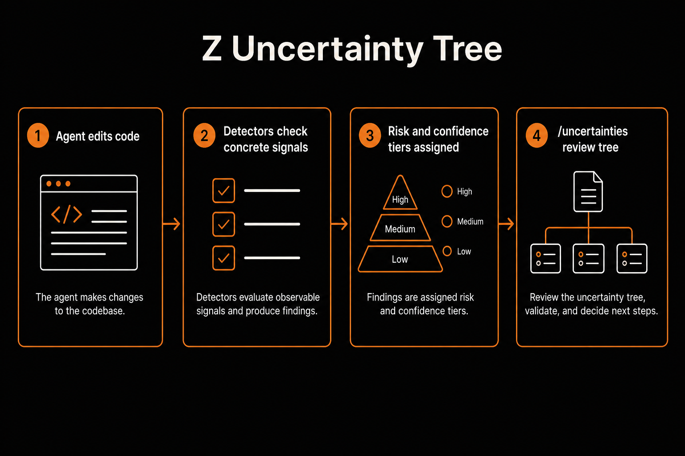

# Z Uncertainty Tree

**See what the agent assumed — before you ship it.**

The Uncertainty Tree is Z’s risk-and-confidence layer. After the agent edits your code, Z checks concrete signals (tests, patterns, secrets, APIs, requirements) and builds a tree of notes: what’s confident, what’s assumed, what’s untested, and what’s risky. You review what actually needs attention — not every line the same way.

---

## The problem it solves

AI coding agents can edit a whole repo in one pass. A wrong change often looks identical to a correct one until something breaks in production.

Traditional “confidence scores” don’t help — they’re usually the model guessing how sure it feels. Z doesn’t do that. It derives **risk** (how bad if wrong) and **confidence** (how sure we are) from **checkable signals**, then puts those notes in a tree you can browse, fix, or ignore.

| Pain | Without the tree | With Z Uncertainty Tree |
|------|------------------|-------------------------|
| Silent assumptions | Agent invents an API shape | **API Assumption** note, low confidence |
| Missing tests | Green chat, red CI later | **Missing Test** / failing-test escalation |
| Half-finished asks | Feature “done” but never built | **Requirement Gap** on the checklist |
| High-stakes edits | Auth/billing look like any other diff | Elevated **risk** from concrete keywords/paths |
| Review overload | Read every line equally | Risk-first tree → review what matters |

In testing, editing one file with an unverified secret key and a partially finished feature produced **6 correctly-traced notes in a single pass** — including catching that a requested feature (receipt emails) was never actually built.

---

## How it works



1. **You give Z a task** — it may decompose a short requirement checklist (“confirm or correct…”)  
2. **The agent edits** — same Aider-backed editing engine you already use  
3. **Detectors run** — on settled edits (and related signals like MCP / self-reported edge cases)  
4. **Nodes land in the tree** — each with separate **risk** and **confidence** tiers  
5. **You browse** — `/uncertainties` to fix, test, explain, ignore, or dig in  

Tiers are **Low / Medium / High**. There are **no fake confidence percentages**.

---

## Risk vs confidence

These are independent axes:

| Axis | Means | Raised by (examples) |
|------|--------|----------------------|
| **Risk** | How bad if this is wrong | Payments/auth/migrations paths; failing tests; large blast radius |
| **Confidence** | How sure we are it’s right | Passing relevant tests; live-verified APIs; matched known patterns |

A change can be **high risk + low confidence** (stop and look) or **low risk + high confidence** (lighter review). High-stakes areas stay visible even when other signals look fine.

---

## What shows up in the tree

Nodes are typed from detectors — not free-form model vibes:

| Node type | Typical signal |
|-----------|----------------|
| Missing Test | Edited code with no co-located / symbol-named tests |
| Edge Case | High-stakes domain (billing, auth, …) or reported unhandled edges |
| API Assumption | Code calls an external API that wasn’t live-verified this session |
| Migration Risk | Migration paths / keywords without clear data-impact handling |
| Pattern Inconsistency | Conflicting conventions across similar files |
| New File (No Pattern Match) | New file with no similar peers to follow |
| Shared Logic / Blast Radius | Symbol referenced widely across the repo |
| TODO / Unclear Comment | `TODO`, `FIXME`, `HACK`, … in touched code |
| Unverifiable Config | Env/secret referenced but not present to verify |
| Requirement Gap | Checklist item never fully addressed |
| High Confidence | Matched known pattern **and** relevant tests passed |

---

## Using it

Inside a Z session:

```text
/uncertainties              Browse the tree (risk-first)
/uncertainties risk         Sort by risk
/uncertainties file         Group by file
/uncertainties session      Group by task / session
/uncertainties 3            Open note #3
```

On a note you can:

| Action | Effect |
|--------|--------|
| **[F]ix** | Mark in progress and prompt the agent to fix it |
| **[T]est** | Mark in progress and prompt for tests |
| **[E]xplain** | Mark needs human review — get an explanation |
| **[I]gnore** | Dismiss for now |
| **[C]ustom** | Your own follow-up instruction |

**Ask, don’t guess:** when relevant tests fail for an edit, Z escalates that note to **Needs Human Review**, bumps risk, and warns you to use `/uncertainties` before proceeding silently.

---

## Statuses

| Status | Meaning |
|--------|---------|
| Open | New / still active |
| In Progress | You’re working it (fix/test/custom) |
| Needs Human Review | Escalated — don’t ignore quietly |
| Resolved | Handled |
| Ignored | Deliberately skipped |
| Blocked | Waiting on something external |

Default listing: **highest risk first**, then **lowest confidence**.

---

## Where it lives

| Layer | Location |
|-------|----------|
| Local store | `~/.z/uncertainty/<repo>.json` (or `$Z_HOME/uncertainty/`) |
| In session | Built as you edit; browse with `/uncertainties` |
| Optional sync | When signed in → workspace via `/v1/uncertainty/*` so the team can share the tree |

Account login unlocks shared workspace sync. Model API keys stay bring-your-own and are separate.

---

## Mental model

```text
task → edits
         │
         ▼
   detectors (checkable signals)
         │
         ▼
   nodes: risk tier × confidence tier
         │
         ▼
   /uncertainties  →  fix / test / explain / ignore
```

---

## Quick example

You ask Z to add a webhook handler and “send receipt emails.” It edits a payments file, references a secret that isn’t in the environment, and never implements receipts.

The tree might surface notes like:

- **Unverifiable Config** — secret key never verified  
- **Missing Test** — no test for the new handler  
- **Edge Case / high risk** — payments path  
- **Requirement Gap** — receipt emails never addressed  

That’s the point: the gap is visible in the tree **before** you merge.

---

## Related

| Doc | What |
|-----|------|
| [README.md](../../README.md) | Product overview |
| [ARCHITECTURE.md](../../ARCHITECTURE.md) | Implementation map (detectors, sync, file paths) |
| [docs/skills/README.md](../skills/README.md) | Reusable playbooks (separate from uncertainty) |

Code lives under `aider/z/uncertainty/` (`engine.py`, `detectors.py`, `ui.py`, …).

---

## Design principles

- **Signals over vibes** — tiers from tests, paths, APIs, checklists — not “I’m 87% sure”  
- **Risk ≠ confidence** — keep them separate so review priority is honest  
- **Visible before ship** — surface notes when edits settle, not after an outage  
- **Human actions** — fix / test / explain / ignore; don’t silently invent certainty  
- **Team-optional sync** — local-first; workspace share when signed in  

That’s the Uncertainty Tree: the agent still ships code — Z makes the guesswork inspectable.
